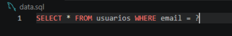

# O que é o PDO? 

*O PDO(php data object) é uma extensão da linguagem php para acesso a banco de dados totalmente orientado a objetos ele possui diversos recursos importantes, além de suporte a diversos mecanismos de banco de dados*

*algumas das principais funcionalidades são:*

- Queries parametrizadas

- Diferentes tipos de retorno

- Diferentes tipos de tratamento de exceções

- Tratamento de transações

# Para que ele é utilizado no PHP

- Conectar ao banco de dados: Estabelecer a ponte de comunicação entre o servidor onde roda o PHP e o servidor do banco de dados (MySQL, PostgreSQL, SQLite, etc.).

- Buscar informações -  Select; Trazer dados gravados no banco para exibi-los na tela (como carregar a lista de produtos de uma loja ou o perfil de um usuário).

- Inserir dados - Insert: Salvar novas informações enviadas por formulários (como cadastrar um novo usuário, salvar um comentário ou registrar uma venda).

- Atualizar dados - Update: Modificar registros que já existem (como alterar a senha do usuário ou atualizar o preço de um produto).

- Deletar dados - Delete: Remover registros do banco de dados quando eles não forem mais necessários.
Proteger o sistema: Filtrar e limpar os dados que vêm do navegador antes de enviá-los ao banco, garantindo que ninguém tente hackear o sistema por meio dos campos de texto.

# O que são Prepared Statements?

*Prepared Statements são uma forma segura de executar comandos SQL usando parâmetros para passar os valores.*
Em vez de colocar diretamente os dados do usuário dentro da consulta SQL, usamos um espaço reservado (?, por exemplo) e enviamos os valores separadamente.
Exemplo

*O ( ? ) seSrá substituído pelo valor informado pelo usuário.*

# Por que são importantes?
*Eles são importantes principalmente para evitar SQL Injection, um tipo de ataque em que uma pessoa pode tentar inserir comandos SQL através dos campos de uma aplicação.*
*Além disso, deixam o código mais organizado e permitem reutilizar a mesma consulta com diferentes valores.*
*Prepared Statements separam o comando SQL dos dados do usuário, tornando as consultas mais seguras e evitando que os dados sejam interpretados como código SQL.*

# quais são suas principais caracteristicas? 

Principais Características: 
Interface Consistente: Usa os mesmos métodos para consultar e recuperar dados, independentemente do banco de dados utilizado. 

Orientação a Objetos: É totalmente baseado em classes e objetos, o que facilita a organização e a manutenção do código. 

Suporte a Múltiplos Bancos: Funciona com vários sistemas (como MySQL, PostgreSQL, SQLite e Oracle) apenas trocando o driver de conexão. 

Consultas Parametrizadas: Permite o uso de declarações preparadas (prepared statements) que protegem a aplicação contra ataques de Injeção de SQL.

Gerenciamento de Transações: Oferece suporte nativo para iniciar, confirmar ou reverter transações de banco de dados (commit e rollback).

Tratamento de Erros: Permite configurar exceções do tipo PDOException para capturar e tratar falhas de forma segura.

# Como funciona uma conexão utilizando PDO;

Uma conexão utilizando PDO funciona criando uma instância da classe nativa PDO, que atua como uma camada de abstração
 para conectar o PHP a diferentes bancos de dados usando uma sintaxe consistente

Como Funciona a Estrutura da ConexãoDSN (Data Source Name): Informa o driver do banco de dados, o endereço do servidor (host) e o nome do banco (dbname).Credenciais: Recebe o  nome de usuário e a senha de acesso ao SGBD.